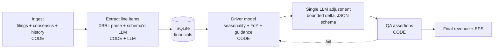
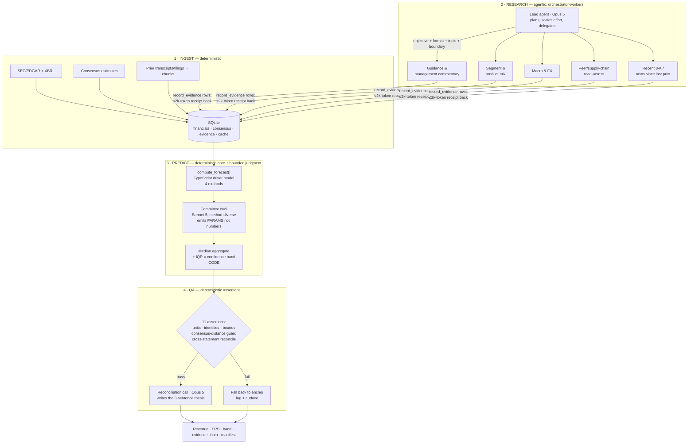
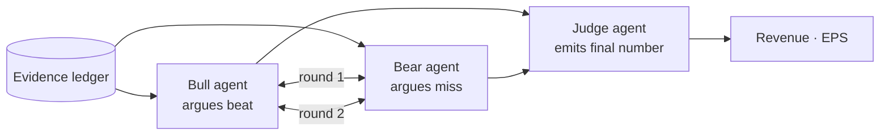

# Agent Architecture for Quarterly Revenue/EPS Forecasting

Research compiled 2026-08-15 for "Agents vs Wall Street" (AI Tinkerers / OpenStocks / OpenAI / Primer), Sat 16 Aug 2026.
Scope: SOTA agent architecture patterns 2025–2026, filtered for an accuracy-critical numeric estimation task.

## Bottom line up front

1. **The accuracy comes from the deterministic core, not the agents.** Every measured result below points the same way: LLM agency helps with *evidence gathering* and *judgment about direction*; it hurts with *arithmetic and magnitude*. Build a deterministic driver model; let agents feed and bound it.
2. **Multi-agent debate is mostly token burn.** Five MAD frameworks across nine benchmarks fail to beat Chain-of-Thought + Self-Consistency at equal budget ([ICLR 2025 blogpost](https://d2jud02ci9yv69.cloudfront.net/2025-04-28-mad-159/blog/mad/)). Self-consistency with median aggregation is the multi-sample technique with real, cheap, replicated gains.
3. **Orchestrator-workers is the one multi-agent pattern with a big measured win** — +90.2% over single-agent on breadth-first research ([Anthropic](https://www.anthropic.com/engineering/multi-agent-research-system)) — and our ingestion/research stage is exactly breadth-first research.
4. **Self-critique without external feedback degrades performance** ([Huang et al., ICLR 2024](https://arxiv.org/pdf/2310.01798)). Our QA stage must be deterministic assertions, not "ask the model to double-check."
5. **The demo and the accuracy want the same thing:** an append-only evidence ledger where every number traces to a source. That single artifact powers the traceability visual, the replay, and the QA gate.

---

## 1. Workflows vs agents: where determinism wins

### 1.1 Anthropic's taxonomy ([Building Effective Agents](https://www.anthropic.com/engineering/building-effective-agents))

Definitions, verbatim:
- **Workflows**: "systems where LLMs and tools are orchestrated through predefined code paths"
- **Agents**: "systems where LLMs dynamically direct their own processes and tool usage"

| Pattern | Use when | Do NOT use when |
|---|---|---|
| **Prompt chaining** | "the task can be easily and cleanly decomposed into fixed subtasks" | decomposition can't be predetermined |
| **Routing** | "distinct categories that are better handled separately" | classification is unreliable |
| **Parallelization — sectioning** | independent subtasks, parallelizable for speed | subtasks are interdependent |
| **Parallelization — voting** | "multiple perspectives are needed"; run the identical task N times | — |
| **Orchestrator-workers** | "complex tasks where you can't predict the subtasks needed" | task structure is predetermined |
| **Evaluator-optimizer** | "clear evaluation criteria, and when iterative refinement provides measurable value" | evaluation criteria are unclear |
| **Autonomous agent** | "open-ended problems where it's difficult or impossible to predict the required number of steps" | paths are predictable; costs must be minimized |

Governing principles:
- "finding the simplest solution possible, and only increasing complexity when needed"
- "you should consider adding complexity *only* when it demonstrably improves outcomes"
- "Agentic systems often trade latency and cost for better task performance"
- Autonomous agents carry "higher costs, and the potential for compounding errors"
- ACI (agent-computer interface): "plan to invest just as much effort in creating good *agent*-computer interfaces (ACI)" as HCI. Poka-yoke your tools — their example: requiring absolute filepaths instead of relative eliminated a class of model error entirely.

### 1.2 OpenAI's equivalent ([A practical guide to building agents](https://openai.com/business/guides-and-resources/a-practical-guide-to-building-ai-agents/), [PDF](https://cdn.openai.com/business-guides-and-resources/a-practical-guide-to-building-agents.pdf))

- "Agents are systems that independently accomplish tasks on your behalf." Applications that "integrate LLMs but don't use them to control workflow execution... are not agents."
- **When NOT to build one:** agents suit "complex decision-making", "difficult-to-maintain rules", and "heavy reliance on unstructured data". "Before committing to building an agent, validate that your use case can meet these criteria clearly. Otherwise, a deterministic solution may suffice."
- Three components: **model, tools, instructions**. Three tool types: **data, action, orchestration**.
- Model selection: "build your agent prototype with the most capable model for every task to establish a performance baseline. From there, try swapping in smaller models."
- Orchestration: start single-agent with more tools; escalate to **manager pattern** (agents-as-tools, central LLM delegates) or **decentralized pattern** (peer handoffs) only when needed. "As the number of required tools increases, consider splitting tasks across multiple agents."

### 1.3 Verdict for an accuracy-critical numeric task

Map our pipeline against the "is it predictable?" test:

| Stage | Predictable path? | Verdict |
|---|---|---|
| Ingestion (fetch filings, consensus, price, historical financials) | Yes — fixed API/parse sequence | **Deterministic.** Zero LLM. |
| Extraction (XBRL/statement line items → SQLite) | Yes for XBRL; no for narrative/guidance PDF | **Deterministic for tagged data; constrained LLM extraction (JSON schema) for narrative only** |
| Research (what matters this quarter? channel checks, guidance, macro, peers) | **No** — subtask count is genuinely unknown per ticker | **Agentic.** Orchestrator-workers. |
| Arithmetic (seasonality, YoY/QoQ, segment build-up, share count → EPS) | Yes | **Deterministic. Code execution / SQL only — never token math.** |
| Judgment (how much does this evidence move the number?) | No | **Agentic, but bounded** — emit a delta in a constrained range, not an absolute |
| QA (unit checks, sign checks, bounds vs consensus and history) | Yes | **Deterministic assertions.** |
| Final number | Yes | **Deterministic aggregation** (median of committee) |

The single most important design decision: **the LLM never emits the final number directly.** It emits structured *inputs* to a calculator (growth rates, segment deltas, margin assumptions), and code computes revenue and EPS. This is the Program-of-Thoughts result (§3.2) applied at architecture level.

---

## 2. Multi-agent patterns: what actually has measured gains

I've split this into **evidence-backed**, **contested**, and **hype**. Demand the number before you build it.

### 2.1 Verdict table

| Pattern | Measured claim | Source | Verdict for us |
|---|---|---|---|
| **Orchestrator-workers (research)** | Multi-agent (Opus 4 lead + Sonnet 4 subagents) beat single-agent Opus 4 by **90.2%** on internal research eval | [Anthropic multi-agent system](https://www.anthropic.com/engineering/multi-agent-research-system) | **BUILD.** Our research stage is the exact shape they measured. |
| **Self-consistency (N samples → majority/median)** | +3.9% to +17.9% across reasoning benchmarks incl. GSM8K | [Wang et al. 2022](https://arxiv.org/abs/2203.11171) | **BUILD.** Cheapest real gain available. Use *median* for continuous outputs. |
| **Median aggregation across LLM ensemble (forecasting)** | 12-LLM ensemble, median-aggregated, is **statistically indistinguishable from a 925-human forecaster crowd**; individual LLMs underperform the crowd | [Schoenegger et al., *Science Advances*](https://www.science.org/doi/10.1126/sciadv.adp1528) | **BUILD.** This is a forecasting-specific result, not a reasoning-benchmark result. Directly transferable. |
| **Multi-agent debate (Du et al.)** | "significantly enhances mathematical and strategic reasoning"; 3 agents × 2 rounds across 6 benchmarks; scales with more agents/rounds | [arXiv 2305.14325](https://arxiv.org/abs/2305.14325), [project page](https://composable-models.github.io/llm_debate/) | **SKEPTICAL — see 2.2** |
| **Mixture-of-Agents (proposers → aggregator layers)** | 65.1% on AlpacaEval 2.0 with OSS models only, vs 57.5% for GPT-4 Omni | [Wang et al., ICLR 2025](https://proceedings.iclr.cc/paper_files/paper/2025/file/5434be94e82c54327bb9dcaf7fca52b6-Paper-Conference.pdf), [repo](https://github.com/togethercomputer/moa) | **PARTIAL — see 2.3.** AlpacaEval is a *preference* benchmark, not numeric accuracy. |
| **Self-MoA (same top model, N samples, aggregate)** | **+6.6% over standard MoA** on AlpacaEval 2.0; +3.8% avg across MMLU/CRUX/MATH | [Li et al. 2025, arXiv 2502.00674](https://arxiv.org/abs/2502.00674) | **BUILD this instead of mixed MoA.** Mixing weaker models lowers average quality. |
| **Intrinsic self-correction / critic loop without external signal** | LLMs "struggle to self-correct... at times, their performance even degrades after self-correction" | [Huang et al., ICLR 2024](https://arxiv.org/pdf/2310.01798) | **DO NOT BUILD** as a bare "check your work" loop. |
| **Verifier with external/ground signal (best-of-N, generative verifiers)** | Verification is measurably easier than generation; GenRM-CoT detects subtle reasoning errors; rounds 1–2 capture ~75% of the gain | [Generative Verifiers, ICLR 2025](https://openreview.net/pdf?id=Ccwp4tFEtE); [Weak verifiers, arXiv 2506.18203](https://arxiv.org/html/2506.18203v1) | **BUILD, but the signal must be external** (arithmetic re-check in code, bounds vs history). Cap at 1–2 rounds. |

### 2.2 The case against debate (read this before building a debate stage)

- **ICLR 2025 blogpost, 5 MAD frameworks × 9 benchmarks** (MMLU, MMLU-Pro, AGI-Eval, CommonSenseQA, ARC-C, GSM8K, MATH, HumanEval, MBPP) on GPT-4o-mini and Llama 3.1: "current MAD frameworks fail to consistently outperform simple single-agent test-time computation strategies", and MAD "cannot scale well with increased inference budget." — <https://d2jud02ci9yv69.cloudfront.net/2025-04-28-mad-159/blog/mad/>
- **Budget-aware evaluation (EMNLP 2024):** "self-consistency is extremely competitive compared to multi-agent debate and reflexion, when evaluated in a budget-aware manner"; CoT+SC beat other strategies across model sizes, while "multi-agent debate and Reflexion often decrease performance with more budget." — <https://aclanthology.org/2024.emnlp-main.1112.pdf>
- Even Du et al.'s own framing concedes debate is "only slightly better than self-consistency with the same number of agents."
- Recurring finding across follow-ups: **majority voting accounts for most of the gain attributed to debate**, and inter-agent sycophancy can drive premature consensus *below* the single-agent baseline.
- **MAST (Why Do Multi-Agent LLM Systems Fail?, [arXiv 2503.13657](https://arxiv.org/abs/2503.13657), NeurIPS 2025):** 14 failure modes from 150 traces (κ=0.88), 1600+ annotated traces across 7 frameworks. **44.2% system design issues** (role/spec disobedience, pointless repetition, unaware termination, loss of conversation history), **37% inter-agent misalignment** (context collapse, contradicting earlier decisions, YAML-vs-JSON format mismatches), rest task verification. Headline: "performance gains on popular benchmarks are often minimal" and "many failures stem from poor system design, not model performance."

**Practical consequence:** if we want the *look* of a debate for the judges, render it as a UI layer over independent samples + a deterministic aggregator. Do not put a debate in the accuracy path.

### 2.3 Mixture-of-Agents caveat

MoA's headline is real but on AlpacaEval 2.0 (LLM-judged preference). The follow-up matters more for us: **Self-MoA — aggregating N samples from the single best model — beats mixed-model MoA by 6.6%**, because "MoA performance is rather sensitive to quality, and mixing different LLMs often lowers the average quality" ([arXiv 2502.00674](https://arxiv.org/abs/2502.00674)). Translation for a one-day build: sample your best model N times, don't wire up a heterogeneous zoo.

### 2.4 Finance-specific evidence (the part that actually decides our design)

This is where the literature gets uncomfortable, and it's the most important section in this doc.

| Finding | Source |
|---|---|
| **Pro-LLM:** GPT-4 with analyst-mimicking CoT on anonymised, standardised financial statements predicts *direction* of future earnings change at **60.35% accuracy — ~7pp above human analysts** one month post-release. Trading strategies on its predictions show higher Sharpe and alpha. | Kim, Muhn & Nikolaev, [arXiv 2407.17866](https://arxiv.org/abs/2407.17866) |
| **Anti-LLM:** On *magnitude* — GAAP EPS forecasts from earnings press releases, hindsight-free around the knowledge cutoff — "GPT forecasts are **significantly less accurate than those of analysts**." GPT beats analysts in only ~25% of firm-quarters. Accuracy correlates with `MetricOverlap` (whether GPT picked the financially salient metrics) and **degrades past the knowledge cutoff**. | Li, Shen, Tu & Zhou, [arXiv 2412.01069](https://arxiv.org/pdf/2412.01069) / [SSRN 4480947](https://papers.ssrn.com/sol3/papers.cfm?abstract_id=4480947) |
| **Benchmarks lie:** FinCall-Surprise, 2,688 earnings calls, 26 models evaluated — "many models achieve high accuracy, [but] this performance is often an illusion caused by significant class imbalance." Fin-tuned models scored as low as 10–12%. | [ACL 2026](https://aclanthology.org/2026.acl-long.610.pdf) |
| **Classical ML beats analysts on magnitude:** Random forest on public data — MAPE **13.29%** vs analysts' **59.48%** (median 6.69% vs 5.21%) on European firm revenue. Decision-tree models dominate deep nets here. | Kureljusic & Reisch, [Corporate Ownership & Control](https://virtusinterpress.org/IMG/pdf/cocv19i2art13.pdf) |
| **Agentic RAG with role-specialised agents + a causal-temporal knowledge graph** achieves SOTA zero-shot on post-earnings shock prediction across NASDAQ/NYSE/MAEC, beating larger LLMs and fine-tuned models on macro-F1/MCC/Sharpe. Explicitly designed to fight "narrative bias — echoing overly optimistic managerial tone." | CARAG, [EACL 2026](https://aclanthology.org/2026.eacl-long.141/) |
| Transcript-only earnings-surprise direction: hierarchical FinBERT 76.6%, BigBird 75.9% (balanced binary). Text alone carries real signal. | Koval et al., [ACL Findings 2023](https://aclanthology.org/2023.findings-acl.520.pdf) |
| Multimodal (tabular + text + macro, 8 quarters) beats every unimodal baseline on earnings-surprise MSE; careful fusion matters. | [EMNLP Findings 2024](https://aclanthology.org/2024.findings-emnlp.486/) |

**Synthesis — the design rule this implies:**
> LLMs are good at *direction and salience*, bad at *magnitude*. Analysts are good at magnitude. So: anchor on consensus + a deterministic model for the magnitude, and use the agent stack to decide **which direction and how far to deviate from that anchor**, with the deviation bounded and evidence-backed. Deviating from consensus is where you win or lose the accuracy score; the agent's job is to earn each basis point of deviation.

Note also the **hindsight-free** warning: models score better on pre-cutoff quarters. Our eval harness must backtest on quarters after the model cutoff, or we'll fool ourselves overnight and lose on the day.

---

## 3. Deterministic tools for agents

### 3.1 Structured outputs — non-negotiable for numeric answers

OpenAI's Structured Outputs: gpt-4o-2024-08-06 scores **100% on complex JSON schema following** vs **<40% for gpt-4-0613**. The mechanism is not prompting — it's "constrained sampling or constrained decoding... converting the supplied JSON Schema into a context-free grammar, restricting the model to generating tokens that adhere to the schema's rules." Model training alone got 93%; the deterministic grammar constraint closed the remaining 7%. — <https://openai.com/index/introducing-structured-outputs-in-the-api/>

Anthropic equivalent: `output_config: {format: {type: "json_schema", schema: ...}}` on `messages.create`, plus `strict: true` on tool definitions (requires `additionalProperties: false` + `required`). Note **assistant prefill returns 400 on Claude Opus 5 / Sonnet 5 / Fable 5 and the 4.6+ family** — if you know the old "prefill a `{`" JSON trick, it's dead; use structured outputs.

Schema design for our numbers:
```jsonc
{
  "type": "object",
  "additionalProperties": false,
  "required": ["revenue_usd_millions", "eps_diluted_usd", "confidence", "evidence_ids"],
  "properties": {
    "revenue_usd_millions": { "type": "number" },
    "eps_diluted_usd":      { "type": "number" },
    "confidence":           { "type": "string", "enum": ["low","medium","high"] },
    "evidence_ids":         { "type": "array", "items": { "type": "string" } }
  }
}
```
Note the schema-limitation gotcha: numeric constraints (`minimum`/`maximum`/`multipleOf`) and string length constraints are **not supported** by either provider's constrained decoder. Bounds must be enforced in your own code after parsing — which is fine, because that's the QA gate anyway.

### 3.2 Force arithmetic through code, not tokens

**Program of Thoughts (PoT)** — express reasoning as executable Python, delegate computation to the interpreter: **~12% average gain over CoT across all evaluated datasets**, few-shot and zero-shot. Crucially the evaluation set includes three financial-QA datasets — **FinQA, ConvFinQA, TATQA** — alongside GSM/AQuA/SVAMP/TabMWP/MultiArith. "PoT succeeds in decoupling computation from reasoning." — [Chen et al., TMLR 2023, arXiv 2211.12588](https://arxiv.org/abs/2211.12588)

This is the single highest-confidence technical result for our task. Implementation options, best first:

1. **Best: no code generation at all.** Write the driver model as TypeScript once (`computeRevenue()`, `computeEPS()`). The agent emits *parameters*; your code runs the arithmetic. Deterministic, testable, fast, zero sandbox risk.
2. **Second: SQL over SQLite.** Historical seasonality, YoY growth, segment mix, TTM — all clean SQL. Give the agent a read-only `query_financials(sql)` tool over a fixed schema. Free replay + audit as a side effect.
3. **Third: code-execution tool** for genuinely ad-hoc math. Anthropic: `{"type": "code_execution_20260120", "name": "code_execution"}` (server-side sandbox, Python 3.11 with pandas/numpy/statsmodels pre-installed, no internet). Use only for exploration, not for the final number.

**Hard rule: any number that appears in the final answer must be traceable to a SQL query result or a TypeScript function return, never to a token the model emitted after doing mental math.**

### 3.3 Tool design (ACI)

From Anthropic's context-engineering guidance: tools should be "self-contained, robust to error, and extremely clear with respect to their intended use." The failure mode to avoid is "bloated tool sets that cover too much functionality or lead to ambiguous decision points about which tool to use." The heuristic: *"If a human engineer can't definitively say which tool should be used in a given situation, an AI agent can't be expected to do better."* — <https://www.anthropic.com/engineering/effective-context-engineering-for-ai-agents>

Anthropic's multi-agent post reports "bad tool descriptions can send agents down completely wrong paths," and that having Claude itself rewrite descriptions of a flawed tool produced a **40% decrease in task completion time**. Budget 20 minutes tomorrow for a "have the model critique our tool descriptions" pass — it's the highest ROI 20 minutes in the day.

Proposed tool surface (deliberately small — 6 tools):
| Tool | Type | Notes |
|---|---|---|
| `query_financials(sql)` | data | read-only SQLite, fixed schema, row cap |
| `get_consensus(ticker, period)` | data | returns revenue + EPS consensus, n_analysts, dispersion, as-of date |
| `search_filings(ticker, query)` | data | over pre-ingested 10-Q/10-K/8-K/transcript chunks |
| `web_search(query)` | data | scoped, domain-allowlisted |
| `record_evidence(claim, value, source_url, confidence)` | action | **appends to the evidence ledger — the demo's spine** |
| `compute_forecast(params)` | orchestration | the deterministic driver model |

### 3.4 Validating and bounding outputs

Deterministic post-conditions, run in code, every run:
- **Unit/scale check:** revenue within 2 orders of magnitude of last quarter's; EPS sign plausible vs TTM.
- **Identity check:** implied YoY and QoQ growth recomputed from the number; reject if it disagrees with the stated growth rate by >0.1pp.
- **Consensus-distance guard:** if `|forecast − consensus| / consensus > k` (start k=10% revenue / 20% EPS), the run must either cite ≥2 independent evidence IDs justifying it or fall back to the anchor. This directly operationalises the Li et al. finding that LLM magnitude judgment is worse than analysts'.
- **Cross-statement consistency:** revenue × implied net margin × (1/diluted shares) reconciles to the EPS you're reporting.
- **NaN/Infinity/null trap:** structured outputs guarantee a number, not a *sane* number.

Every failed assertion is a demo asset — show the gate rejecting a bad run.

---

## 4. Context management for the research stage

### 4.1 How deep-research systems are structured

**OpenAI Deep Research** — o3 variant trained end-to-end with RL on hard browsing/reasoning tasks; "learned to plan and execute a multi-step trajectory to find the data it needs, backtracking and reacting to real-time information." Architecture is described as **centralized control flow: core reasoning in a single orchestrating agent managing global state and memory, with integrated planning and verification leveraging CoT and self-consistency**. Scores 26.6% on Humanity's Last Exam. — <https://openai.com/index/introducing-deep-research/>

**Anthropic's multi-agent research system** — orchestrator-worker: "a lead agent coordinates the process while delegating to specialized subagents that operate in parallel." Key operational numbers:
- +90.2% over single-agent Opus 4 on their internal breadth-first research eval
- **token usage alone explains 80% of the variance** on BrowseComp; model choice and tool-call count are secondary
- agents use ~4× the tokens of chat; multi-agent systems ~**15×**
- parallelization (3–5 subagents spun up concurrently, each using 3+ tools in parallel) **cut research time by up to 90%**
- effort scaling rule: "Simple fact-finding requires just 1 agent with 3-10 tool calls, direct comparisons might need 2-4 subagents with 10-15 calls each, and complex research might use more than 10 subagents"
- delegation contract: "Each subagent needs an objective, an output format, guidance on the tools and sources to use, and clear task boundaries."

**The caveat they publish themselves, which we must respect:** "some domains that require all agents to share the same context or involve many dependencies between agents are not a good fit for multi-agent systems today." Our *research* stage has no cross-agent dependencies (great fit). Our *prediction* stage has total dependency on shared context (bad fit — keep it single-threaded).

### 4.2 Context isolation and artifact memory

From [Effective context engineering for AI agents](https://www.anthropic.com/engineering/effective-context-engineering-for-ai-agents):
- **Context rot:** "as the number of tokens in the context window increases, the model's ability to accurately recall information from that context decreases." Attention is a finite budget.
- **Sub-agents:** "specialized sub-agents can handle focused tasks with clean context windows," each returning a condensed summary of **typically 1,000–2,000 tokens** to the coordinator.
- **Structured note-taking:** agents "regularly write notes persisted to memory outside of the context window."
- **Just-in-time retrieval:** hold "lightweight identifiers (file paths, stored queries, web links)" and load at runtime, rather than pre-loading corpora.
- **Compaction:** summarize near the limit — "maximize recall to capture all relevant information, then improve precision by eliminating superfluous content."

**Our translation:** SQLite *is* the artifact memory. Subagents never return prose to the orchestrator — they `record_evidence(...)` rows and return a ≤200-token receipt (`"wrote 7 evidence rows, ids 41–47, highest-confidence: Q3 guidance range $8.1–8.3B"`). The orchestrator's context stays tiny and the prediction stage reads the ledger by SQL, not by conversation history. This one decision kills the two biggest MAST failure modes at once (context collapse and loss of conversation history, together 37%+ of failures).

---

## 5. Reliability engineering

### 5.1 Self-consistency for a continuous target

Standard self-consistency takes a majority vote over discrete answers. Revenue and EPS are continuous, so:

- **Aggregate with the median, not the mean.** Schoenegger et al. call the median "an unexpectedly powerful aggregation mechanism [that] works across a myriad of contexts," and it's what made the LLM crowd match the human crowd. It's also robust to the one sample that hallucinated a 10× scale error — which is exactly the failure mode structured outputs *don't* prevent.
- **N = 7–11.** Odd, and past ~11 the marginal variance reduction stops paying for the latency.
- **Report the interquartile range as your confidence interval.** Free calibration signal, and a great demo visual: a dot plot of N samples with the median highlighted and consensus as a vertical line.
- **Sample diversity must come from somewhere.** On Claude Opus 5 / Sonnet 5 / Opus 4.7+ and Fable 5, `temperature`, `top_p`, and `top_k` are **removed and return 400** — you cannot get diversity by cranking temperature. Get it structurally instead: vary the *evidence subset* each sample sees, vary the *method* (seasonal-naive vs YoY-growth vs segment build-up vs guidance-midpoint), or vary the model. Varying method is better anyway — it's a genuine ensemble, not sampling noise, and it demos beautifully as "four analysts, four methodologies."

### 5.2 Temperature, seeds, determinism

- **Anthropic (current models):** sampling params rejected. Determinism control is `output_config: {effort: "low"|"medium"|"high"|"xhigh"|"max"}` plus `thinking: {type: "adaptive"}`. For numeric estimation, `effort: "high"` on the final estimator and `low`/`medium` on research subagents.
- **OpenAI:** temperature 0 for extraction and the estimator. Note that temperature 0 has *never* guaranteed identical outputs on any provider — do not build reproducibility on it.
- **Real determinism comes from caching, not from seeds.** See below.

### 5.3 Caching tool results = reproducibility + speed + cost

Cache every external call keyed on `(tool_name, canonicalised_args)` into SQLite with the raw response and a fetch timestamp. This gives you four things at once:
1. **Reproducible demos** — replay a run offline if the venue wifi dies at 6pm. (Assume it will.)
2. **Fast eval loops** — backtest 30 tickers without re-fetching.
3. **Cost control** — the same 10-Q is parsed once.
4. **Audit** — the judges can see the exact bytes each claim came from.

Add a `--offline` flag that errors on cache miss. Run the final demo with it on.

**Prompt caching** is a separate, large lever. It's a *prefix match* — "any change anywhere in the prefix invalidates everything after it," render order `tools` → `system` → `messages`. Cache reads cost ~0.1× base input; writes 1.25× (5-min TTL). Break-even is two requests. With N=9 committee samples over an identical system prompt + evidence block, this is close to free money. Watch the silent invalidators: `Date.now()` in a system prompt, unsorted `JSON.stringify`, a per-run UUID, or a varying tool list will silently zero your hit rate. Verify with `usage.cache_read_input_tokens` — if it's 0 across identical-prefix requests, something is invalidating.

### 5.4 Retries

- SDK-level: Anthropic and OpenAI SDKs auto-retry 408/409/429/5xx with exponential backoff (default 2 retries). Don't reimplement.
- Application-level: retry a *failed schema validation* once with the validator error appended. Retry a *failed QA assertion* zero times — fall back to the anchor and log it. A number that fails bounds twice is not a number to ship.
- Cap the whole run with a wall-clock deadline and a token budget. Anthropic's beta `task_budget` (`output_config.task_budget`, header `task-budgets-2026-03-13`, min 20k) tells the model its budget so it paces itself and wraps up gracefully — distinct from `max_tokens`, which is an enforced cap the model can't see.

### 5.5 Run manifests

Emit one JSON manifest per run — this is simultaneously the audit artifact, the demo prop, and the eval harness's input:

```jsonc
{
  "run_id": "uuid",
  "git_sha": "…",
  "started_at": "2026-08-16T14:02:11Z",
  "ticker": "NVDA", "period": "FY2027Q3",
  "models": { "orchestrator": "claude-opus-5", "workers": "claude-haiku-4-5", "estimator": "claude-opus-5" },
  "config": { "committee_n": 9, "effort": "high", "consensus_guard_k": 0.10 },
  "cache": { "hits": 41, "misses": 3, "offline": true },
  "evidence_ids": [1, 2, 3, "…"],
  "samples": [ { "method": "seasonal", "revenue": 8140, "eps": 1.02 }, "…" ],
  "final": { "revenue_usd_m": 8180, "eps": 1.04, "iqr_revenue": [8090, 8260] },
  "consensus": { "revenue_usd_m": 8050, "eps": 1.01, "n_analysts": 34 },
  "qa": { "assertions_run": 11, "assertions_failed": 0, "fallback_triggered": false },
  "usage": { "input_tokens": 487000, "output_tokens": 34000, "cost_usd": 1.42 },
  "wall_clock_s": 168
}
```

---

## 6. What demos well to judges

Hackathon judging signal for 2025–26, from the write-ups: judges reward **detailed architecture diagrams**, "substantial, original, and sophisticated implementation", and whether AI is "central to functionality or just a minor addition" ([Microsoft AI Agents Hackathon 2025 rules](https://microsoft.github.io/AI_Agents_Hackathon/rules/)). The most useful specific signal from the 2026 playbooks: judges increasingly **"score the trace logs rather than just judging demo videos"** — a shift toward measurable agent performance over polish ([AngelHack 2026 playbook](https://angelhack.com/blog/ai-agent-hackathon/)). Also consistent across sources: scope down to one working feature and ship a *live* demo; execution beats novelty.

Given a "best agent architecture" prize specifically, four things to build:

**1. Live activity view.** A single-screen board: orchestrator node, N worker nodes lighting up as they run in parallel, tool calls streaming, token counters ticking. Parallelism is *visible* — five workers firing simultaneously reads as architecture in a way a spinner never does. Both SDKs stream; wire SSE to a small React page. Budget 90 min.

**2. Evidence chain: source → claim → number.** The killer visual for this specific competition. Click the final revenue number → see the three evidence rows that moved it → click a row → see the filing snippet and URL with the sentence highlighted. This is the whole differentiator: everyone will have a number, almost nobody will be able to *defend* it in 30 seconds. It falls out of the evidence ledger for free.

**3. Replayable runs.** `pnpm forecast --replay run_abc123 --offline`. Deterministic, no network, sub-second. Tells the judges you engineered it rather than got lucky, and it's insurance against venue wifi.

**4. The eval harness on screen.** Backtest 20–30 past quarters where truth is known, plot our error vs consensus error. If we beat consensus on MAPE, that chart wins the accuracy half of the judging on its own. If we don't, showing the honest chart plus a calibrated confidence interval still reads as rigor. **Build this before lunch** — it's what tells you whether the agent layer is helping at all.

Instrumentation: emit [OpenTelemetry GenAI semantic convention](https://opentelemetry.io/blog/2026/genai-observability/) spans — `invoke_agent` parent with child `chat` and `execute_tool` spans, `gen_ai.request.model`, `gen_ai.usage.input_tokens`/`output_tokens`, `gen_ai.response.finish_reasons`. Even a home-rolled JSON span log in this shape gives you a trace tree to render, and it's the vocabulary judges who work in this space will recognise. Don't add a vendor SDK on hackathon day; log the spans yourself into SQLite.

---

## 7. Cost and latency budget

**Pricing** (Anthropic figures are authoritative as of 2026-06-24; OpenAI figures are from third-party aggregators — **verify against the official page before relying on them**):

| Model | Input $/1M | Output $/1M | Role |
|---|---|---|---|
| Claude Opus 5 (`claude-opus-5`) | $5.00 | $25.00 | orchestrator, final estimator |
| Claude Sonnet 5 (`claude-sonnet-5`) | $3.00 (**$2.00 intro through 2026-08-31**) | $15.00 (**$10.00 intro**) | estimator committee |
| Claude Haiku 4.5 (`claude-haiku-4-5`) | $1.00 | $5.00 | research subagents, extraction |
| GPT-5.6 Sol | ~$5.00 | ~$30.00 | alternative orchestrator |
| GPT-5.6 Terra | ~$2.00 | ~$12.00 | alternative estimator |
| GPT-5.6 Luna | ~$0.20 | ~$1.20 | alternative worker |

The Sonnet 5 intro pricing runs through **31 Aug 2026** — it's live on hackathon day. Cache reads are ~0.1× input on Anthropic; ~90% discount on OpenAI.

**Per-run token budget** (one ticker, one quarter):

| Stage | Model tier | Input | Output | Notes |
|---|---|---|---|---|
| Ingestion + XBRL parse | none | 0 | 0 | pure code |
| Narrative extraction (3 docs) | small | ~90k | ~6k | structured outputs, parallel |
| Research: 5 subagents × ~10 tool calls | small | ~250k | ~15k | parallel; each returns ≤2k receipt |
| Orchestrator planning + delegation | large | ~25k | ~4k | reads receipts, not raw content |
| Estimator committee, N=9 | mid | ~110k | ~14k | identical prefix → prompt-cacheable |
| QA + reconciliation | large | ~20k | ~3k | 1 call; assertions are code |
| **Total** | | **~495k** | **~42k** | |

**Cost:** with a Haiku/Sonnet/Opus split and prompt caching on the committee prefix, **~$1–3 per run**. A 30-quarter backtest is **$30–90**. Even at 5× overrun this is a rounding error against provided credits — *do not optimise cost tomorrow.* Optimise latency and correctness.

**Latency budget** (target: under 3 minutes on stage):

| Stage | Serial | Parallel | Lever |
|---|---|---|---|
| Ingestion | 15s | 5s | `Promise.all` over sources |
| Research | ~5 min | **~60–90s** | 5 subagents concurrent; 3+ tools concurrent per agent |
| Committee N=9 | ~4 min | **~30s** | all 9 concurrent |
| QA + final | 15s | 15s | mostly code |
| **Total** | ~10 min | **~2.5 min** | |

Anthropic measured up to **90% research-time reduction** from exactly this two-level parallelism. It is also the most visually obvious thing on the demo screen. Build the concurrency early — retrofitting `Promise.all` at 6pm is how demos die.

**Big vs small model placement:**
- **Small (Haiku 4.5 / Luna):** research subagents, document chunk extraction, classification, evidence tagging. High volume, narrow task, schema-constrained. This is where the token mass is.
- **Mid (Sonnet 5 at intro pricing):** the estimator committee. N=9 of these is cheaper than N=3 Opus and — per Self-MoA — sampling the same good model more times beats mixing tiers.
- **Large (Opus 5 / Sol):** orchestrator planning (one call), and the final reconciliation/judgment call (one call). Two calls, maximum leverage.

Follow OpenAI's stated method: prototype everything on the most capable model tonight to establish the ceiling, then downgrade per-stage tomorrow morning and watch the eval harness. Never downgrade blind.

---

## Implications for our build

Three candidates. All three share the same substrate — SQLite schema, evidence ledger, deterministic driver model, eval harness — so **build the substrate first and the architecture choice stays reversible until ~2pm.**

### Candidate A — "Deterministic Spine"

A pure workflow. Prompt chain, zero autonomy. The safety net.



| | |
|---|---|
| **Deterministic** | ingestion, XBRL extraction, all arithmetic, seasonality, QA gate, final aggregation |
| **Agentic** | one narrative-extraction call, one bounded-adjustment call |
| **Expected accuracy** | **High floor, low ceiling.** Anchors on consensus + seasonality, which the Kureljusic/Reisch and Li et al. results say is already competitive with analysts. Almost impossible to blow up. Captures none of the direction-signal upside Kim et al. found. |
| **Build cost** | **4–5 hours** |
| **Demo appeal** | **Low.** Judges see a script. Loses "best agent architecture" outright. |

### Candidate B — "Analyst Desk" ★ RECOMMENDED

Orchestrator-workers for research (the pattern with the 90.2% number), evidence ledger as shared memory, deterministic driver model, method-diverse committee with median aggregation, deterministic QA gate.



| | |
|---|---|
| **Deterministic** | ingestion, XBRL, driver model arithmetic, all 4 forecast methods, median aggregation, every QA assertion, consensus-distance guard, caching/replay |
| **Agentic** | lead agent's research plan and subagent count (genuine unknown-subtask problem — the exact Anthropic use case); 5 parallel research workers; committee members choosing *parameters* within bounds; one final reconciliation/narrative call |
| **Expected accuracy** | **Highest of the three.** Stacks four independently-evidenced gains: orchestrator-workers on research breadth (+90.2% analogue), self-consistency median aggregation (+3.9–17.9%, and the *Science Advances* result that median-aggregated LLM crowds match human crowds), PoT-style computation offload (+12% on FinQA/ConvFinQA/TATQA-inclusive eval), and structured outputs (100% vs <40% schema compliance). The consensus-distance guard is what stops the Li et al. magnitude failure from hurting us. |
| **Build cost** | **8–9 hours** — substrate 3h, orchestrator+workers 2h, committee+aggregation 1.5h, QA gate 1h, UI 1.5h. Fits the day with two people. |
| **Demo appeal** | **Highest.** Five workers lighting up in parallel; a clickable source→claim→number chain; a dot plot of nine methodologically-distinct analysts converging on a median; a QA gate visibly rejecting a bad run; a backtest chart vs consensus; `--replay --offline`. Directly targets "best agent architecture." |

### Candidate C — "Debate Floor" (Bull / Bear / Judge)

Two adversarial agents argue the print up and down over 2 rounds; a judge agent rules.



| | |
|---|---|
| **Deterministic** | ingestion only |
| **Agentic** | everything downstream, including the final number |
| **Expected accuracy** | **Worst, and the evidence is unambiguous.** Five MAD frameworks × nine benchmarks fail to beat CoT+SC at equal budget; budget-aware evaluation finds debate "often decrease[s] performance with more budget"; majority voting explains most of debate's apparent gain; inter-agent sycophancy can push accuracy *below* single-agent. It also violates the design rule from §2.4 by letting an LLM emit the magnitude directly, and structurally invites the narrative bias CARAG was built to suppress. |
| **Build cost** | 6–7 hours |
| **Demo appeal** | **Highest theatre, and judges who know the literature will ask about the ICLR result.** |

**Verdict on C: do not put it in the accuracy path.** But steal its best idea — a bull and a bear *research* worker inside Candidate B's stage 2, each instructed to hunt disconfirming evidence for the other's thesis and file it to the ledger. You get the adversarial drama and the coverage benefit, while the number still comes out of the deterministic aggregator. That's the honest version of the debate demo.

### Recommendation: **Candidate B, built as a superset of A**

Sequencing that keeps the day de-risked:

| Time | Milestone |
|---|---|
| **09:00–12:00** | Substrate: SQLite schema, ingestion, XBRL parse, consensus fetch, tool-result cache, **eval harness with 20 known past quarters**. |
| **12:00–13:00** | **Candidate A end-to-end and scoring.** This is the fallback that guarantees a submission. Record its MAPE vs consensus — it's your baseline for every later decision. |
| **13:00–15:00** | Stage 2: orchestrator + 5 parallel workers + evidence ledger. Re-run eval. **Keep only if MAPE improves.** |
| **15:00–16:30** | Committee N=9 + median aggregation + QA gate. Re-run eval. Same rule. |
| **16:30–18:00** | Demo UI: live activity view, evidence chain, backtest chart, `--replay --offline`. |
| **18:00–19:00** | Freeze code. Run the demo three times on cached data. Write the 3-minute script. |

Two rules that matter more than the architecture:
1. **Every added agentic stage must earn its place on the eval harness.** That's Anthropic's own "add complexity only when it demonstrably improves outcomes," and given §2's evidence base, at least one of our stages probably won't earn it. Be willing to delete it at 4pm.
2. **Backtest on post-cutoff quarters.** Li et al. found GPT's forecast accuracy measurably degrades past its knowledge cutoff, and Koval et al. warn explicitly about look-ahead bias in temporal splits. A harness built on pre-cutoff quarters will report a number we cannot reproduce on the live ticker tomorrow.

---

## Sources

**Primary — vendor engineering**
- Anthropic, Building Effective Agents — <https://www.anthropic.com/engineering/building-effective-agents>
- Anthropic, How we built our multi-agent research system — <https://www.anthropic.com/engineering/multi-agent-research-system>
- Anthropic, Effective context engineering for AI agents — <https://www.anthropic.com/engineering/effective-context-engineering-for-ai-agents>
- OpenAI, A practical guide to building agents — <https://openai.com/business/guides-and-resources/a-practical-guide-to-building-ai-agents/> · [PDF](https://cdn.openai.com/business-guides-and-resources/a-practical-guide-to-building-agents.pdf)
- OpenAI, Introducing Structured Outputs in the API — <https://openai.com/index/introducing-structured-outputs-in-the-api/>
- OpenAI, Introducing deep research — <https://openai.com/index/introducing-deep-research/>

**Multi-agent evidence and critiques**
- Du et al., Improving Factuality and Reasoning through Multiagent Debate — <https://arxiv.org/abs/2305.14325> · <https://composable-models.github.io/llm_debate/>
- Multi-LLM-Agents Debate: Performance, Efficiency and Scaling Challenges (ICLR 2025 blogpost) — <https://d2jud02ci9yv69.cloudfront.net/2025-04-28-mad-159/blog/mad/>
- Budget-Aware Evaluation of LLM Reasoning Strategies (EMNLP 2024) — <https://aclanthology.org/2024.emnlp-main.1112.pdf>
- Cemri et al., Why Do Multi-Agent LLM Systems Fail? (MAST, NeurIPS 2025) — <https://arxiv.org/abs/2503.13657>
- Wang et al., Mixture-of-Agents (ICLR 2025) — <https://proceedings.iclr.cc/paper_files/paper/2025/file/5434be94e82c54327bb9dcaf7fca52b6-Paper-Conference.pdf> · <https://github.com/togethercomputer/moa>
- Li et al., Rethinking Mixture-of-Agents / Self-MoA — <https://arxiv.org/abs/2502.00674>
- Huang et al., Large Language Models Cannot Self-Correct Reasoning Yet (ICLR 2024) — <https://arxiv.org/pdf/2310.01798>
- Zhang et al., Generative Verifiers (ICLR 2025) — <https://openreview.net/pdf?id=Ccwp4tFEtE>
- Shrinking the Generation-Verification Gap with Weak Verifiers — <https://arxiv.org/html/2506.18203v1>
- Wang et al., Self-Consistency Improves Chain of Thought Reasoning — <https://arxiv.org/abs/2203.11171>
- Chen et al., Program of Thoughts Prompting (TMLR 2023) — <https://arxiv.org/abs/2211.12588>

**Finance-specific**
- Kim, Muhn & Nikolaev, Financial Statement Analysis with LLMs — <https://arxiv.org/abs/2407.17866>
- Li, Shen, Tu & Zhou, The Promise and Peril of Generative AI: GPT-4 as Sell-Side Analysts — <https://arxiv.org/pdf/2412.01069> · <https://papers.ssrn.com/sol3/papers.cfm?abstract_id=4480947>
- FinCall-Surprise (ACL 2026) — <https://aclanthology.org/2026.acl-long.610.pdf>
- CARAG: Context-Enriched Agentic RAG for Post-Earnings Price Shocks (EACL 2026) — <https://aclanthology.org/2026.eacl-long.141/>
- Koval et al., Forecasting Earnings Surprises from Conference Call Transcripts (ACL Findings 2023) — <https://aclanthology.org/2023.findings-acl.520.pdf>
- Financial Forecasting from Textual and Tabular Time Series (EMNLP Findings 2024) — <https://aclanthology.org/2024.findings-emnlp.486/>
- Kureljusic & Reisch, Revenue forecasting: analysts vs machine learning — <https://virtusinterpress.org/IMG/pdf/cocv19i2art13.pdf>
- Schoenegger et al., Wisdom of the silicon crowd (*Science Advances*) — <https://www.science.org/doi/10.1126/sciadv.adp1528>

**Observability and demo**
- OpenTelemetry, Inside the LLM Call: GenAI Observability (2026) — <https://opentelemetry.io/blog/2026/genai-observability/>
- AngelHack, How To Run An AI Agent Hackathon: A 2026 Playbook — <https://angelhack.com/blog/ai-agent-hackathon/>
- Microsoft AI Agents Hackathon 2025, judging rules — <https://microsoft.github.io/AI_Agents_Hackathon/rules/>
